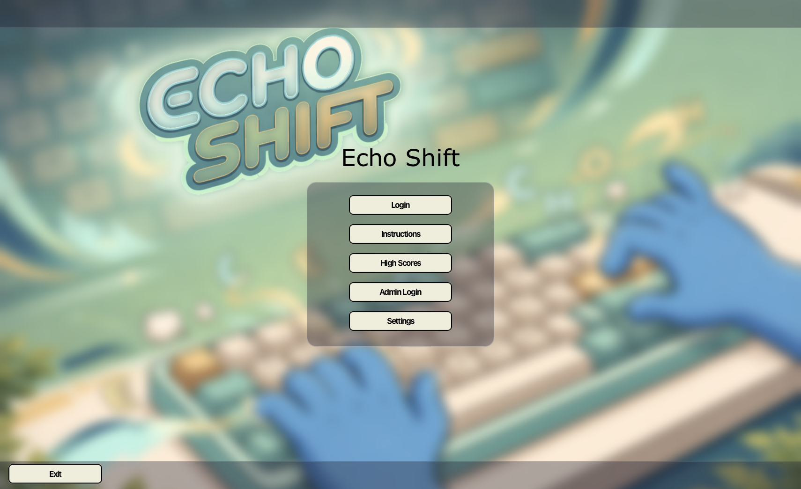
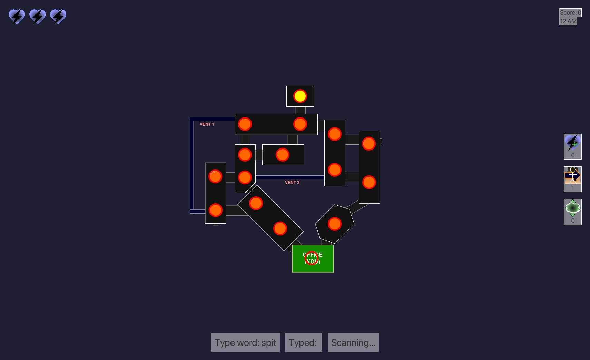

<div align="center">

# Echo Shift

**Type fast. Track the Entity. Survive until 6 AM.**

A survival-horror typing game built with Java and JavaFX for Western University's **COMPSCI 2212** course in Canada.

[Getting started](#getting-started) · [How to play](docs/USER_GUIDE.md) · [Development](docs/DEVELOPMENT.md) · [Project history](docs/PROJECT_HISTORY.md)

</div>



<details>
<summary>See the gameplay screen</summary>



</details>

## The game

You're the night-shift worker in a factory with something loose in the halls. Every correctly typed word buys you a chance to find it—or draw it away from your office.

- **Three nights:** increasingly difficult words and a faster-moving enemy.
- **Typing with a purpose:** complete words to scan the map or lure the Entity into an adjacent room.
- **Power-ups and progression:** earn coins, visit the shop, and stock up before your next shift.
- **Local player profiles:** save typing statistics, high scores, inventory, and unlocked nights.
- **Atmosphere:** illustrated factory maps, ambient audio, and an animated enemy tracker.

## Getting started

This is a **plain Java project**, built with `javac` and run with `java`.

You need **JDK 23**, a **JavaFX 25.0.2 SDK** matching your operating system and CPU, and a **Gson JAR** (tested with 2.11.0). The cross-platform helper uses Python 3 and has no Python dependencies.

```sh
git clone https://github.com/tudor-pristav/EchoShift.git
cd EchoShift

# Point to libraries already downloaded on your machine.
export JAVAFX_LIB="/path/to/javafx-sdk-25.0.2/lib"
export GSON_JAR="/path/to/gson-2.11.0.jar"

python3 scripts/build.py run
```

For Windows PowerShell, IntelliJ setup, and direct Java commands, see the [development guide](docs/DEVELOPMENT.md).

Try **Login** with demo player `test` and password `test`. To create another profile, use **Admin Login** (`admin` / `test`) and choose **Create Account**. Survive a six-minute shift to unlock the next night.

## Controls

| Action | What to do |
| --- | --- |
| Scan | Type the displayed word without selecting a room. |
| Lure | Click a room, then complete a word. The Entity must be in an adjacent room. |
| Use a power-up | Click its icon on the right side of the gameplay screen. |
| Return after a shift | Click **Return to Player Home**. |

Mistyping a letter fails the current word and costs points. Uppercase and lowercase input are both accepted. See the [full user guide](docs/USER_GUIDE.md) for accounts, levels, and power-ups.

## Build and checks

```sh
python3 scripts/build.py build  # Compile and copy images, audio, CSS, and word banks
python3 scripts/build.py test   # Regression checks using temporary save files
python3 scripts/build.py smoke  # Briefly open and exercise real JavaFX screens
python3 scripts/build.py docs   # Generate API documentation in build/docs
```

The original JUnit tests are also preserved; see [test instructions](docs/DEVELOPMENT.md#tests).

## Documentation and origins

Originally developed on Western's GitLab and later merged into this GitHub repository. The migration preserved the course README, generated API documentation, and development history.

| Resource | Location |
| --- | --- |
| Player guide | [docs/USER_GUIDE.md](docs/USER_GUIDE.md) |
| Build, tests, and architecture | [docs/DEVELOPMENT.md](docs/DEVELOPMENT.md) |
| Migration and documentation inventory | [docs/PROJECT_HISTORY.md](docs/PROJECT_HISTORY.md) |
| Original course README | [EchoShift/README.md](EchoShift/README.md) |
| Original generated Javadoc | [EchoShift/docs](EchoShift/docs) — open `index.html` locally |

## Authors

Bob Zhang · Ho Long Adrian Lee · Matthew Michael Taylor · Tudor-Mihai Pristav · Yasmine Suojhayer

## Project scope

Echo Shift is a local course project. Accounts use plaintext passwords in `data/`; use demo-only passwords. The included accounts and saves are demonstration data.

## License

Source code and original documentation are licensed under the [MIT License](LICENSE). Bundled artwork, audio, and third-party components have separate terms; see [third-party notices](THIRD_PARTY_NOTICES.md).
